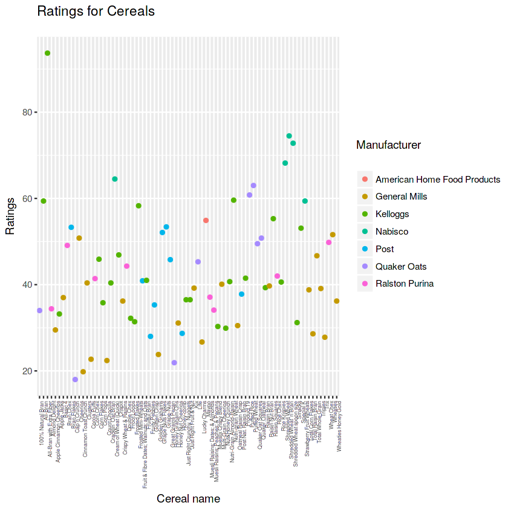
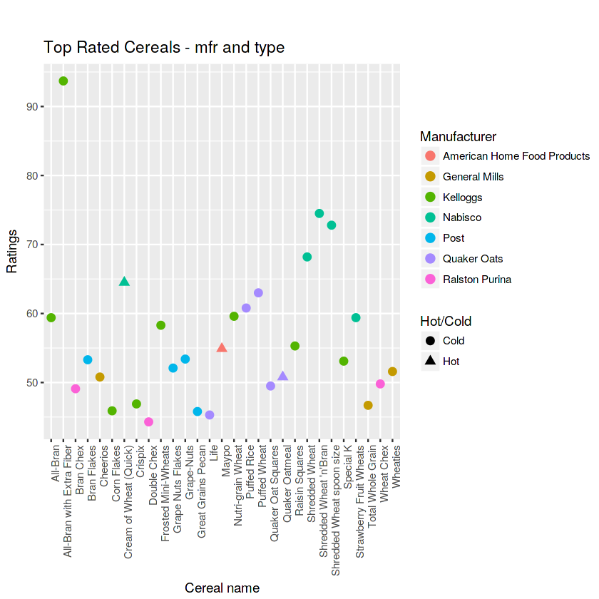
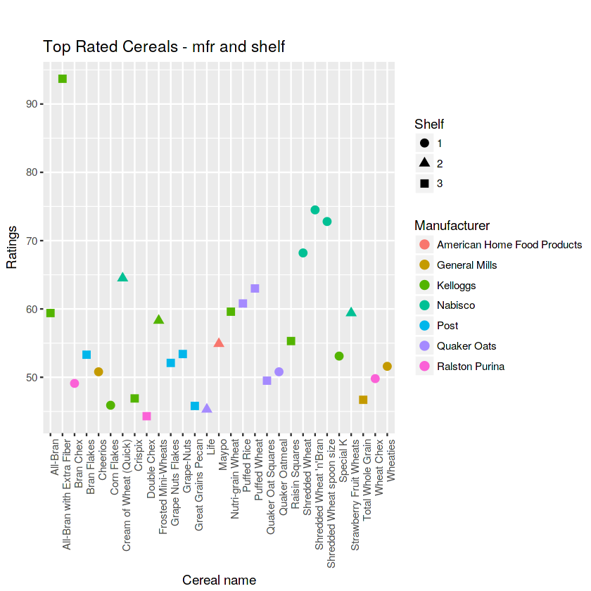
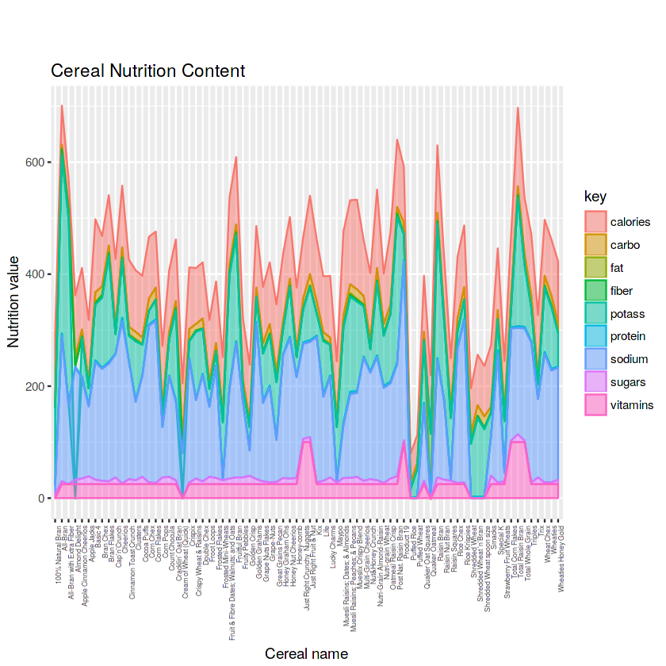
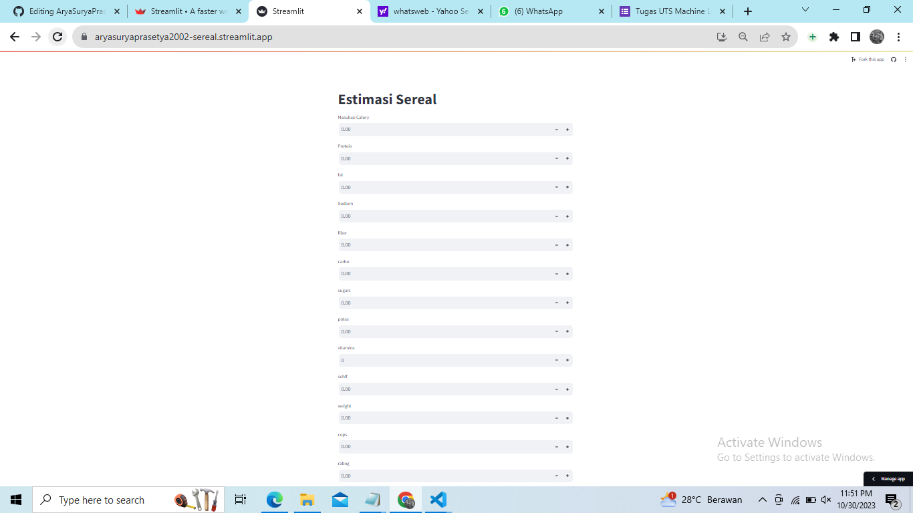

# Laporan Proyek Machine Learning
### Nama : Arya Surya Prasetya
### Nim : 211351030
### Kelas : Pagi A

## Domain Proyek
Proyek ini di buat untuk meng klasifikasikan tentang target sereal
dan sengaja membuat klasifikasi proyek ini
## Business Understanding
Pemahaman bisnis sereal mengacu pada pemahaman tentang industri makanan sereal, yang melibatkan produksi, distribusi, pemasaran, dan penjualan produk makanan yang terbuat dari sereal.


Bagian laporan ini mencakup:

### Problem Statements
Dalam kasus ini masalah nya dalam seral target ,dan menentukan nilai accuracy tentang target
 

### Goals
Menemukan klasifikasi target sereal


### Solution statements
Sereal adalah pilihan sarapan yang praktis dan sehat. anda dapat menambahkan potongan buah buahan segar atau yogurt untuk variasi yang lebih seimbang.

## Data Understanding
Name: Name of cereal
mfr: Manufacturer of cereal
A = American Home Food Products;
G = General Mills
K = Kelloggs
N = Nabisco
P = Post
Q = Quaker Oats
R = Ralston Purina
type:
cold
hot
calories: calories per serving
protein: grams of protein
fat: grams of fat
sodium: milligrams of sodium
fiber: grams of dietary fiber
carbo: grams of complex carbohydrates
sugars: grams of sugars
potass: milligrams of potassium
vitamins: vitamins and minerals - 0, 25, or 100, indicating the typical percentage of FDA recommended
shelf: display shelf (1, 2, or 3, counting from the floor)
weight: weight in ounces of one serving
cups: number of cups in one serving
 [Klasifkasi Sereal 8](https://www.kaggle.com/datasets/crawford/80-cereals)





 
## Data Preparation
### Data Collection
Untuk dataset ini saya mengambil dari kaggle ,kalau kalian mau ambil dari link di atas

### Data Discovery And Profiling
```bash
import pandas as pd
import numpy as np
import matplotlib.pyplot as plt
import seaborn as sns
```

```bash
from google.colab import files
files.upload()
```

```bash
!mkdir -p ~/.kaggle
!cp kaggle.json ~/.kaggle/
!chmod 600 ~/.kaggle/kaggle.json
!ls ~/.kaggle
```

```bash
!unzip archive.zip -d sereal
!ls sereal
```

```bash
Archive:  archive.zip
  inflating: sereal/cereal.csv       
cereal.csv
```

```bash
df = pd.read_csv("/content/sereal/cereal.csv")
```
```bash
df.head()
```
```bash
df.info()
```
```bash
df.isna().sum()
```
```bash
plt.figure(figsize=(10,8))
sns.heatmap(df.corr(),annot=True)
```
``` bash
df.head()
```
```bash
df.info()
```
``` bash
features = ['mfr', 'type', 'calories', 'protein', 'fat', 'sodium', 'fiber', 'carbo', 'sugars','potass', 'vitamins','shelf']
x = df[features]
y = df['weight']
x.shape, y.shape
```
```bash
x_test.shape
```
```bash
from sklearn.linear_model import LinearRegression
lr = LinearRegression()
lr.fit(x_train,y_train)
pred = lr.predict(x_test)
```
```bash
df.head()
```
```bash
df.info()
```
```bash
from sklearn.model_selection import train_test_split
x_train, x_test, y_train, y_test = train_test_split(x, y,test_size=0.5, random_state=100)
y_test.shape
x_train.shape
```

```bash
x_test.shape
```

``` bash
df['first_floor'] = (df.floor.str.split('/').str[0] == '1').astype(int)
from sklearn.linear_model import LinearRegression
lr = LinearRegression()
lr.fit(x_train,y_train)
pred = lr.predict(x_test)
```
```bash
score = lr.score(x_test,y_test)
print('Akurasi model Regresi Linear', score)
```
``` bash
print(x)
```
```bash
input_data = np.array([[70,4,1,130,10.0,5.0,6,280,25,3,1.0,0.33,68.402973]])
```
Estimasi Rating target : [68.402973]
Nilai Target adalah : 10
/usr/local/lib/python3.10/dist-packages/sklearn/base.py:439: UserWarning: X does not have valid feature names, but LinearRegression was fitted with feature names
  warnings.warn(

``` bash
import pickle

filename = 'Sereal.sav'
pickle.dump(lr,open(filename,'wb'))
```

## Evaluation


``` bash 
from sklearn.metrics import precision_recall_curve, f1_score

threshold = 200000

y_pred_binary = (y_pred > threshold).astype(int)
y_test_binary = (y_test > threshold).astype(int)

f1 = f1_score(y_test_binary, y_pred_binary)

print('F1 Score:', f1)
```
dan hasil yang saya dapatkan adalah 1.0 atau 100%, itu berarti model ini memiliki keseimbangan yang baik antara presisi dan recall. Karena kita mencari model yang presisi sangat dibutuhkan agar kemungkinan terjadinya kesalahan semakin sedikit.

## Deployment

[My Estimation App](https://aryasuryaprasetya2002-sereal.streamlit.app/).


