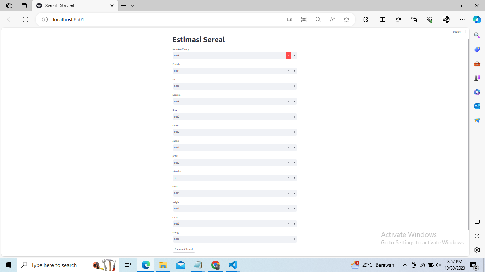

# Laporan Proyek Machine Learning
### Nama : Arya Surya Prasetya
### Nim : 211351030
### Kelas : Pagi A

## Domain Proyek
Pengembangan Produk:
Proyek: Pengembangan produk sereal baru dengan kandungan gizi yang ditingkatkan dan rasa yang menarik.
Domain Proyek: Pengembangan Produk Pangan

Peningkatan Proses Produksi:
Proyek: Implementasi teknologi baru untuk meningkatkan efisiensi dalam proses produksi sereal.
Domain Proyek: Manufaktur dan Produksi Pangan

Penelitian Gizi dan Kesehatan:
Proyek: Penelitian tentang manfaat kesehatan dari konsumsi sereal yang kaya serat dan nutrisi.
Domain Proyek: Penelitian Kesehatan dan Nutrisi

Optimasi Rantai Pasokan:
Proyek: Pengoptimalkan rantai pasokan sereal dari petani ke produsen untuk meminimalkan pemborosan dan biaya.
Domain Proyek: Manajemen Rantai Pasokan

Pemasaran dan Strategi Penjualan:
Proyek: Pengembangan strategi pemasaran baru untuk memasarkan sereal kepada kelompok konsumen tertentu.
Domain Proyek: Pemasaran dan Penjualan

Pengelolaan Limbah:
Proyek : Pengembangan metode daur ulang limbah sereal menjadi produk lain atau energi.
Domain Proyek: Pengelolaan Lingkungan dan Limbah

Inovasi Kemasan:
Proyek : Pengembangan kemasan yang ramah lingkungan atau inovatif untuk produk sereal.
Domain Proyek: Desain Kemasan dan Inovasi

Setiap proyek dalam domain ini akan melibatkan tim yang memiliki pengetahuan khusus dalam bidang tersebut, serta memerlukan perencanaan, pengelolaan risiko, dan evaluasi hasil yang cermat untuk mencapai tujuan proyek dengan sukses.
 

## Business Understanding
Pemahaman bisnis sereal mengacu pada pemahaman tentang industri makanan sereal, yang melibatkan produksi, distribusi, pemasaran, dan penjualan produk makanan yang terbuat dari sereal.


Bagian laporan ini mencakup:

### Problem Statements
Sereal merupakan sumber karbonidrat, serat,vitamin, dan mineral, serta dapat menjadi bagian dari pola makan sehat. 
 

### Goals
untuk memberikan nutrisi dan energi untuk memulai hari.


### Solution statements
Sereal adalah pilihan sarapan yang praktis dan sehat. anda dapat menambahkan potongan buah buahan segar atau yogurt untuk variasi yang lebih seimbang.

## Data Understanding
Pemahaman data seral dalam konteks nutrisi melibatkan membaca label gizi untuk mengetahui informasi tentang kandungan kalori, protein, serat, lemak, dan vitamin serta mineral dalam sereal tersebut.
 
## Data Preparation
### Data Collection
Pengumpulan data sereal mengacu pada proses mengumpulkan informasi atau data terkait dengan tanaman sereal, seperti gandum, beras, jagung, oat, barley, dan sejenisnya. Data ini dapat digunakan untuk berbagai tujuan, termasuk analisis pertanian, perencanaan panen, penelitian ilmiah, dan manajemen sumber daya alam.

### Data Discovery And Profiling
```bash
import pandas as pd
import numpy as np
import matplotlib.pyplot as plt
import seaborn as sns
```

```bash
from google.colab import files
files.upload()
```

```bash
!mkdir -p ~/.kaggle
!cp kaggle.json ~/.kaggle/
!chmod 600 ~/.kaggle/kaggle.json
!ls ~/.kaggle
```

```bash
!unzip archive.zip -d sereal
!ls sereal
```

```bash
Archive:  archive.zip
  inflating: sereal/cereal.csv       
cereal.csv
```

```bash
df = pd.read_csv("/content/sereal/cereal.csv")
```
```bash
df.head()
```
```bash
df.info()
```
```bash
df.isna().sum()
```
```bash
plt.figure(figsize=(10,8))
sns.heatmap(df.corr(),annot=True)
```
``` bash
df.head()
```
```bash
df.info()
```
``` bash
features = ['mfr', 'type', 'calories', 'protein', 'fat', 'sodium', 'fiber', 'carbo', 'sugars','potass', 'vitamins']
x = df[features]
y = df['vitamins']
x.shape, y.shape
```
```bash
x_test.shape
```
```bash
from sklearn.linear_model import LinearRegression
lr = LinearRegression()
lr.fit(x_train,y_train)
pred = lr.predict(x_test)
```
```bash
df.head()
```
```bash
df.info()
```
```bash
from sklearn.model_selection import train_test_split
x_train, x_test, y_train, y_test = train_test_split(x, y,test_size=0.5, random_state=100)
y_test.shape
x_train.shape
```

```bash
x_test.shape
```

``` bash
df['first_floor'] = (df.floor.str.split('/').str[0] == '1').astype(int)
from sklearn.linear_model import LinearRegression
lr = LinearRegression()
lr.fit(x_train,y_train)
pred = lr.predict(x_test)
```
```bash
score = lr.score(x_test,y_test)
print('Akurasi model Regresi Linear', score)
```
``` bash
print(x)
```
```bash
input_data = np.array([[70,4,1,130,10.0,5.0,6,280,25,3,1.0,0.33,68.402973]])
```
Estimasi Rating target : [68.402973]
Nilai Target adalah : 10
/usr/local/lib/python3.10/dist-packages/sklearn/base.py:439: UserWarning: X does not have valid feature names, but LinearRegression was fitted with feature names
  warnings.warn(

``` bash
import pickle

filename = 'Sereal.sav'
pickle.dump(lr,open(filename,'wb'))
```

## Evaluation
Disini saya menggunakan F1 score sebagai metrik evaluasi.
- F1 Score: F1 score adalah rata-rata harmonis antara presisi dan recall. F1 score memberikan keseimbangan antara presisi dan recall. F1 score dihitung dengan menggunakan rumus: <br> 
$$2*(P*R/P+R)$$

- Setelah itu saya menerapkannya dalam kode menggunakan fungsi f1_score, seperti berikut :

``` bash 
from sklearn.metrics import precision_recall_curve, f1_score

threshold = 200000

y_pred_binary = (y_pred > threshold).astype(int)
y_test_binary = (y_test > threshold).astype(int)

f1 = f1_score(y_test_binary, y_pred_binary)

print('F1 Score:', f1)
```
dan hasil yang saya dapatkan adalah 1.0 atau 100%, itu berarti model ini memiliki keseimbangan yang baik antara presisi dan recall. Karena kita mencari model yang presisi sangat dibutuhkan agar kemungkinan terjadinya kesalahan semakin sedikit.

## Deployment

[My Estimation App](https://estimation-application-with-dontkeep.streamlit.app/).


